# FoodRush
User Experience Design for FoodRush: a University Canteen Food Ordering Application.

## Index

- [1. Introduction](#1-introduction)
    - [1.1. The Problem](#11-the-problem)
    - [1.2. Our Solution](#12-our-solution)
    - [1.3. Food Rush](#13-FoodRush)
- [2. Team & Roles](#2-team--roles)
- [3. Strategy](#3-strategy)
    - [3.1. Value Proposition Canvas](#31-value-proposition-canvas)
    - [3.2. UX Personas](#32-ux-personas)
    - [3.3. Benchmarking](#33-benchmarking)
- [4. Scope](#4-scope)
    - [4.1 Customer Journey Map](#41-customer-journey-map)
        - [4.1.1 Decision Stage Interfaces](#411-decision-stage-interfaces)
- [5. Structure](#5-structure)
    - [5.1. Navigation Flow](#51-navigation-flow)
- [6. Skeleton](#6-skeleton)
    - [6.1. Low-Fi Wireframes](#61-Low-fidelity-wireframes)
- [7. Surface](#7-Surface)
    - [7.1. Interface Evolution](#71-Interface-Evolution)
    - [7.2. High Definition Interfaces](#72-high-definition-interfaces)
- [8. Annex](#8-Annex)

---

## 1. Introduction

### 1.1. **The Problem**
University students often face long waiting lines at campus cafeterias during 
peak hours and also students often have **tight schedules** — juggling classes, projects, 
and extracurriculars leaves them with very limited time to eat.. This leads to frustration, time loss between classes, and sometimes even skipped meals.
University cafeterias struggle to manage these rush hours efficiently, leading to delays and decreased customer satisfaction.

From the vendor’s perspective, queues cause inefficiency:

- Limited order throughput during rush hours.
- Manual payment handling that slows down service.

This highlights a clear opportunity for a platform that improves both the user experience for students and the operational flow for campus food vendors. The app can also be used by faculty members who want to pre-order meals between classes or during meetings, further expanding its utility.

### 1.2. **Our Solution**

Food Rush is a digital ordering system that lets students buy food directly from their smartphones and notifies them when their order is ready — eliminating waiting lines and manual payments.

It connects students, university cafeterias, and eventually local restaurants near campus through a single, easy-to-use ecosystem.

#### **🌐 Key Features**

- Mobile Ordering: Place and pay for your meal from your phone.
- Smart Notifications: Receive alerts when your order is ready for pickup.
- Digital Payments: Secure transactions through integrated payment APIs.
- Vendor Dashboard: Cafeterias manage incoming orders in real time.
- Queue Optimization: Reduce peak-time congestion and improve service flow.
- Edenred Integration: Pay using Chile’s university food benefit card, with automatic filters that only show eligible food items.

Our goal is to make food ordering as fast and seamless as possible:
- **Pre-order and pay** from your phone before leaving class.
- Receive a **notification** when your meal is ready.
- **Pick it up instantly**, without waiting in line.

This allows students to manage their meals efficiently — grab their food, enjoy it, and get back to their activities without stress or delay.

### 1.3. **FoodRush**
Food Rush is more than a cafeteria app — it’s a scalable platform for smart food ordering. By digitizing the cafeteria experience, it reduces operational bottlenecks and empowers students to make the most of their time.

Its long-term vision is to become a marketplace for campus-based commerce, connecting local vendors and students through a seamless, cashless experience.

### 💳 Integration with Student Benefit Systems (Edenred)

Food Rush integrates with **Edenred**, Chile’s university food benefit program, allowing students to pay directly using their allocated meal balance.

To ensure compliance with the national nutritional policy, the app automatically:
- **Identifies eligible products** that can be purchased using Edenred funds.
- **Filters out items** with more than two nutritional warning labels (high in sugar, saturated fats, sodium, or calories).

This integration not only simplifies payment but also promotes **healthy and responsible food choices**, aligned with Chilean Ministry of Health regulations.

---

## 2. Team & Roles

Gonzalo Caniupan - Project Manager

Juan Manuel Soto - Analyst

Kihara Millaldeo - Designer

Gonzalo Caniupan - Presenter

---

## 3. Strategy

### 3.1. Value Proposition Canvas

*How we aligned university dining needs with our solution  *

**For Students:**
- Skip the waiting line — order, pay, and get notified when your meal is ready.
- Access real-time menu updates and stock, promotions, and estimated preparation times.
- Enjoy a seamless experience through a modern, intuitive mobile interface.

### 🧩 3.1.1 Identified Gaps

**Operational:**  
Manual ordering processes cause bottlenecks, miscommunication, and longer wait times.

**User Experience:**  
Students waste time in lines and lack visibility over order status or preparation time.

**Technological:**  
Most university cafeterias have no integrated system for online payments or digital queues.

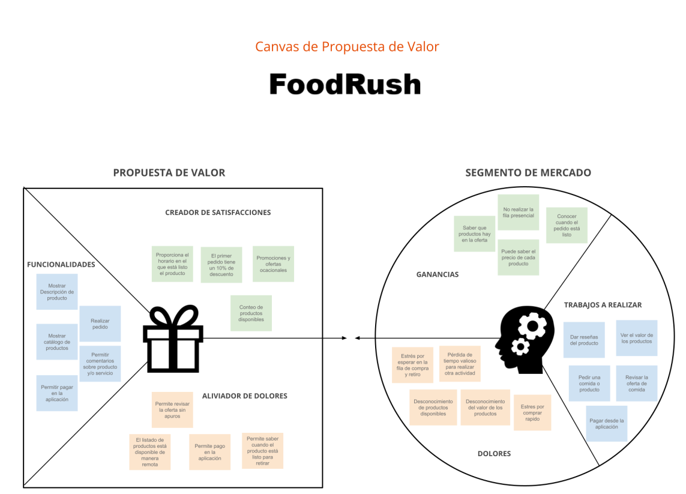

***

### 3.2. **UX Personas**

This section presents representative user profiles that illustrate the different needs, motivations, and behaviors of our main audience.  
These personas help us design user experiences that truly align with the daily routines of students and university staff.

---

👥🔹 **Mauricio Valenzuela**  
*"Between classes and research, I sometimes just want to grab something quick."*

👥🔹 **Cristian Riquelme**  
*"Waiting in line takes away my study time and can make me late for class."*

👥🔹 **Lorena Pérez**  
*"I’d love an app that helps me eat what I want without wasting time."*

---

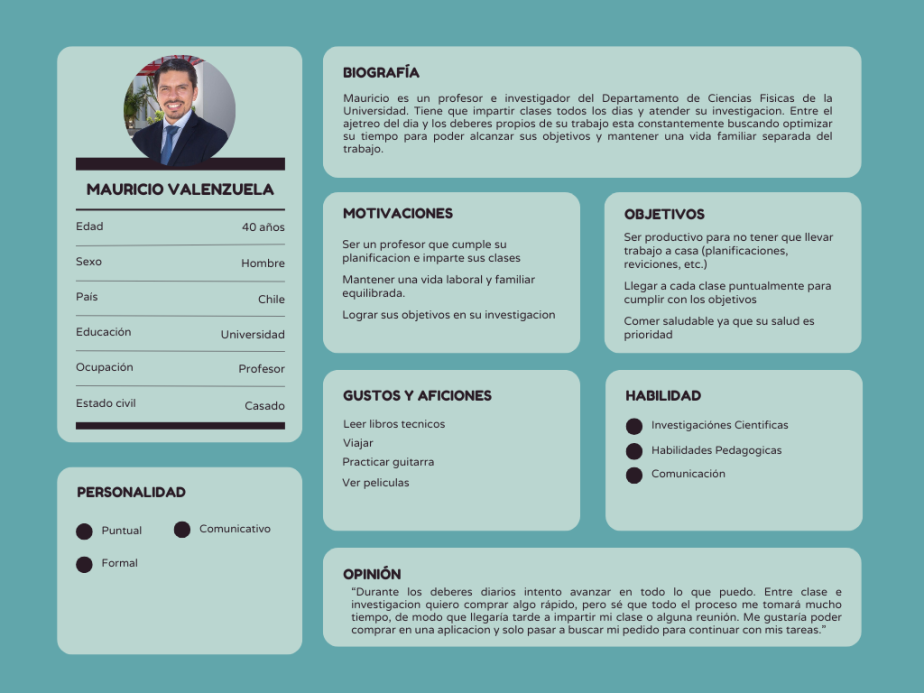

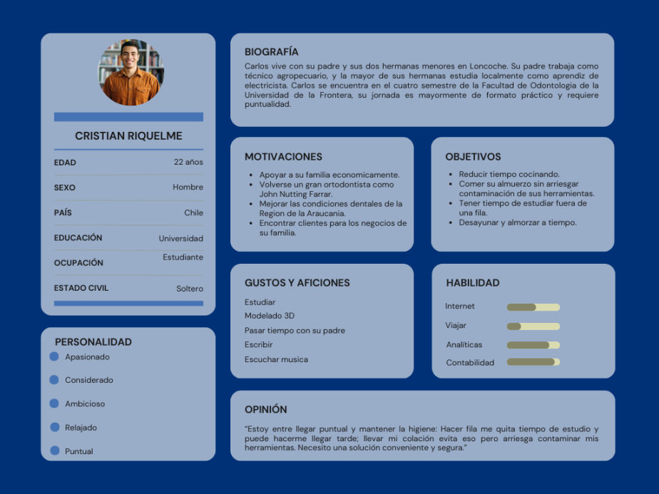

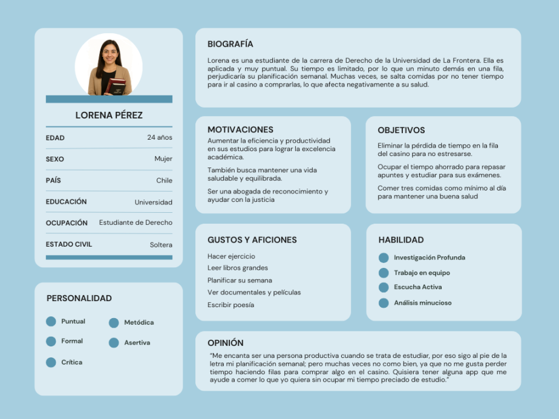

### 3.3. Benchmarking

To design an application that genuinely addresses the needs of university students and campus food vendors, we analyzed existing food delivery and ordering platforms — including both direct competitors and indirect references recognized for their usability, scalability, and user experience.

The objective was to identify **functional and visual strengths** across similar products, learn from their best practices, and pinpoint opportunities where Food Rush can stand out within the campus ecosystem.

---

#### Types of platforms analyzed

- 🍔 **Direct competitor:**  
  **PedidosYa** — Although it’s a leading food delivery app in Latin America, it is not tailored to the university environment. It focuses on full delivery services rather than quick on-campus pickup experiences.

- ⚖️ **Visual comparison tools:**  
  **Rappi** and **Uber Eats** — Both platforms provide highly optimized interfaces for browsing and comparing food options quickly. Their order-tracking flows, restaurant categorization, and clean layouts served as valuable references for usability and interaction design.

- 🖼️ **Aesthetic references:**  
  **Rappi** and **PedidosYa** — Both apps inspired the visual direction of Food Rush, particularly their use of vibrant color palettes, rounded UI elements, and iconography that communicates speed and convenience.

---

By combining insights from these platforms, Food Rush aims to deliver a **focused, lightweight, and context-aware experience** — optimized for campus life, where time, simplicity, and accessibility are key.

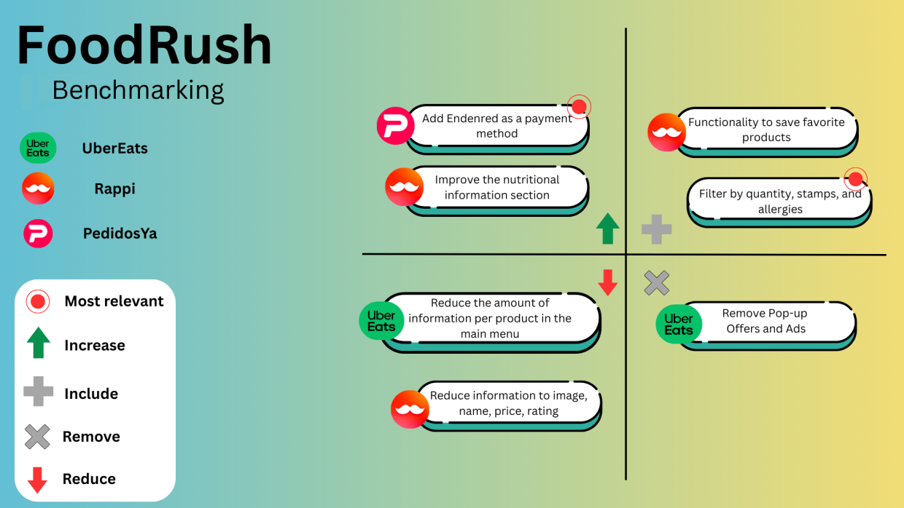

---

## 4. Scope

### 4.1. Customer Journey Map

We identified four key stages in the user's interaction with FoodRush:

- 🔍 Awareness
- 🤔 Consideration
- ✅ Decision
- 💬 Loyalty & Advocacy

These stages reflect the complete journey — from first contact to long-term perception and potential recommendation.

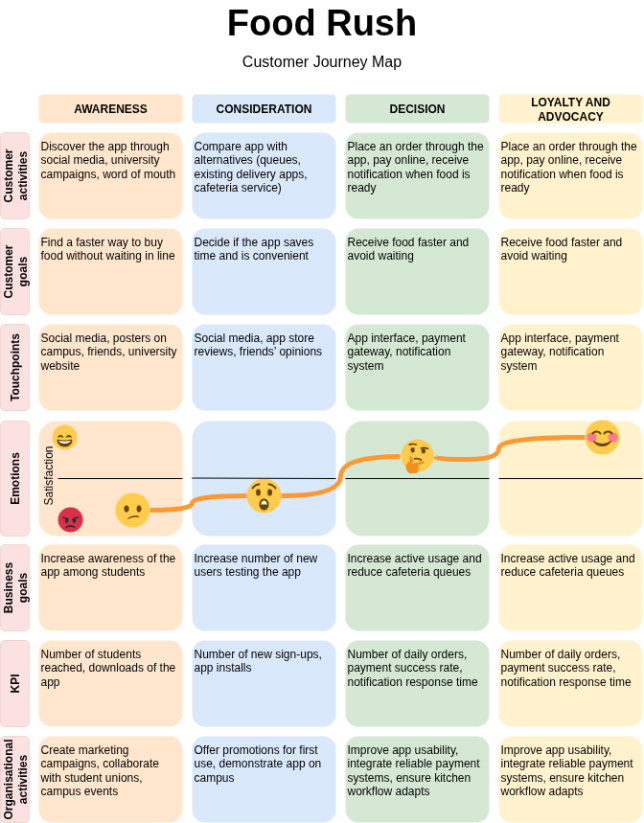

#### 4.1.1. Decision Stage Interfaces

**Customer Activities**  
During the **Decision** stage, users actively interact with the app: browsing menus, selecting items, and placing an order. They use features such as product filtering, payment options (including *Edenred*), and real-time notifications when their order is ready.  
The app interface is designed to minimize waiting times and ensure a fast, reliable pickup experience.

**Customer Goals**  
Users want to receive their food quickly and conveniently, without wasting time standing in line. For many students and staff members, time efficiency is the primary motivation for using the app. The decision to use Food Rush comes when they perceive it as a faster, smarter alternative to traditional queues.

**Touchpoints**  
At this stage, the main touchpoints are the **mobile app interface**, the **payment gateway**, and the **notification system**.
- The **app interface** focuses on simplicity and clarity.
- The **payment gateway** ensures security and compatibility with common payment methods and *Edenred*.
- The **notification system** informs users when their order is ready, reinforcing reliability and trust.

---

## 5. Structure

### 5.1. Navigation Flow

The **Food Rush** navigation flow was designed to provide a fast, intuitive, and user-centered experience, reducing waiting times and unnecessary steps during the ordering process.  
The structure prioritizes clarity and quick access to key features, ensuring that both students and university staff can order food effortlessly from their mobile devices.

---

#### 🧭 Key Sections:

- **Profile:**  
  Users can manage personal data, configure payment methods (including Edenred), and customize app preferences.

- **Search Products:**  
  Allows users to explore available meals, view product details, read reviews, and filter by options eligible for Edenred or other payment types.

- **Cart:**  
  Users can review their selected products, choose a payment method, and confirm the order.

- **Orders:**  
  Displays details of past orders, helping users reorder their favorites or check transaction records.

- **Favorites:**  
  Provides quick access to saved meals or frequently purchased products.

- **Notifications:**  
  Keeps users informed about order status updates, promotions, and ready-for-pickup alerts.

---

#### ⚙️ Accessibility and Flow

- The user journey begins with **Registration** or **Login**, leading directly to the **Home** interface.
- From there, users can seamlessly navigate across main modules without leaving the home environment.
- The design minimizes friction between **searching**, **ordering**, and **receiving notifications**, supporting a fluid interaction loop.
- Each step of the flow reinforces Food Rush’s main value: **saving time and improving on-campus dining convenience.**

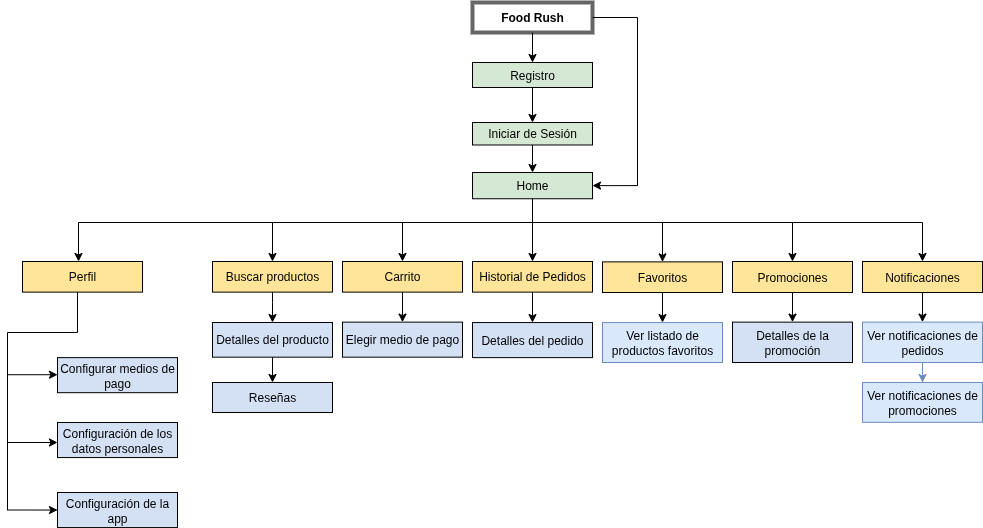

---

## 6. Skeleton

### 6.1. Low-fidelity wireframes

The wireframes developed serve as an initial approximation of the structure and visual layout of the interfaces tied to FoodRush's core functionalities—specifically, ordering food from university canteens.

Navigation between screens is primarily handled through a persistent top navigation bar, present across all interface screens for seamless user flow.

In the early iterations, the interfaces were initially organized into three main categories:

- Interfaces related to payment types.
- Interfaces related to Menu/Food Item Selection.
- Interfaces related to Order Status and History.

📄 **[Low-Fi Wireframes – FoodRush (PDF)](docs/wireframes-foodrush.pdf)**  
PDF version of the entire initial wireframe set, covering all main interface screens from the early design phase.

---

## 7. Surface

### 7.1. Interface Evolution

## Interface Evolution Process: Explanations and Key Reasons for Modifications

The interfaces for FoodRush evolved significantly from the initial low-fidelity wireframes to the final high-fidelity prototypes, focusing on streamlining the food ordering process within the university setting. The core reason for most modifications was to simplify navigation, enhance speed, and improve the visual communication of essential food details (like Chilean sellos or seals).

**Homepage Evolution**

Categories Filter: Introduced "Todo" (All) and "Sin Sellos" (No Seals) as a quick filter option. This directly addresses student dietary concerns and speed of selection. Visual Appeal: Products now show real images, names, and prices, immediately engaging the user. Bottom Navigation Bar: Solidified the persistent bottom bar for core actions: Pedidos (Orders), Favoritos (Favorites), Home, Notificaciones (Notifications), Mi perfil (My Profile).

  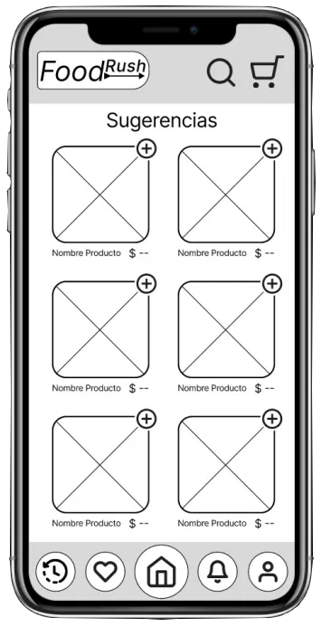
  &nbsp; &nbsp; &nbsp;
  

**Product Detail Evolution**

Removal of Delivery Time: Since the app focuses on canteen/on-campus ordering, delivery time is often irrelevant or managed through a separate pickup system, so the clock icon was removed for simplicity. Visual Seals: The text "-Sellos Alto en" was replaced with highly visible, standardized seal graphics. Details Section Refinement: The long text list of details was replaced by a concise descriptive line ("Oblea bañada chocolate 29g"), likely pushing extensive nutritional data to a separate, less distracting screen (not shown). Action Button: The black "Agregar al carrito" button was changed to a high-contrast orange button for better visibility and conversion.

  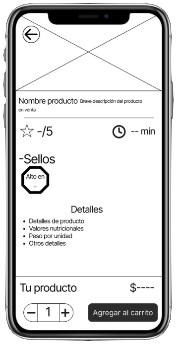
  &nbsp; &nbsp; &nbsp;
  

**Cart and Checkout Evolution**

Reduced Cognitive Load: The final design acts as a gateway; clicking a button (like "Edenred") likely leads to a separate screen for data entry, rather than cluttering the initial checkout screen with fields for RUT, Clave, etc. This is a common and more secure UX pattern. Branding: Payment options now include recognizable logos, building trust.

  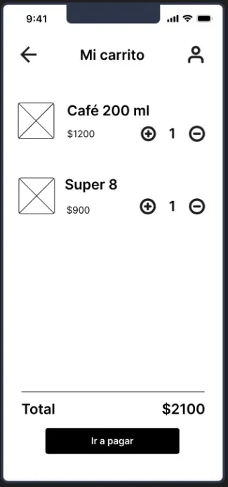
  &nbsp; &nbsp; &nbsp;
  

  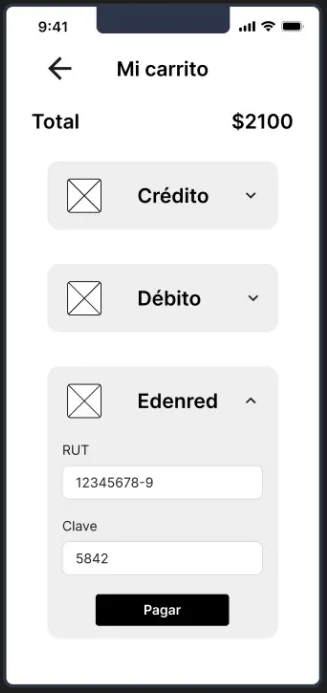
  &nbsp; &nbsp; &nbsp;
  

**Order Receipt and QR Code Evolution**

Improved Readability: The final design uses clear typography and visual cues (numbered items, orange price tags) to quickly convey the order summary. Clarity of Action: The button was renamed from the technical "Comprobante" to the user-focused "Generar QR," clearly indicating the next step in the flow (generating the pickup code).

Focus and Speed: For a canteen pickup, the only critical information is the QR code itself. By removing the repetitive date/time/price information, the screen becomes cleaner and the QR code is the sole focus, making the exchange with the vendor faster and error-free. The orange color of the QR code aligns with the app's branding and increases its visual impact.

  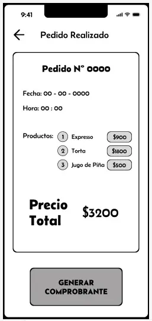
  &nbsp; &nbsp; &nbsp;
  

  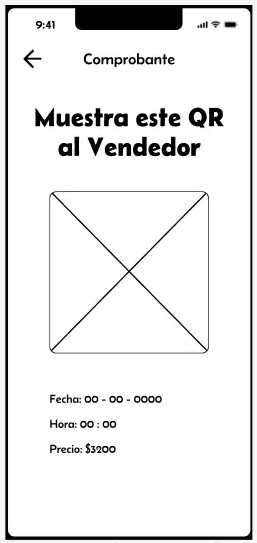
  &nbsp; &nbsp; &nbsp;
  

***

#### Redesign of the navigable prototype

The final visual design aimed to create an app that felt fast, trustworthy, and easy to use for a student audience needing quick transactions.

✅ **High-Contrast Orange:** Selected as the primary action color. It is highly visible and evokes energy, speed, and appetite—perfect for a food app.

✅ **Integration of Real-World Constraints (Sellos):** Prioritizing the visual display of Chilean food seals in the product view directly addresses a crucial consumer concern in Chile, making the app more compliant and transparent.

✅ **Simplified Payment Flow:** Moving from an initial flow that exposed sensitive fields (RUT, Clave) on the main payment screen to one that uses large, clean buttons significantly improves security perception and reduces friction.

✅ **Exploration and comparison of options:** Because informed decisions also require concrete data and comparative analysis.

The evolution shows a clear shift from a purely functional structure to a high-fidelity interface prioritizing user experience, visual branding, and regulatory context (food seals).
***

### 7.2. High Definition Interfaces

With the functional structure defined by the low-fidelity wireframes and the key user experience issues resolved during the evolution phase (Section 7.1), the project transitioned to the High-Fidelity Interface design. This stage focused on translating the successful elements into a polished, branded, and visually appealing mobile application ready for university student use.

The final interfaces establish the FoodRush brand identity, leveraging a high-contrast orange-and-dark blue palette to ensure accessibility and highlight primary actions like "Add to Cart" and "Pay." The design heavily emphasizes the speed and clarity required for a successful quick-service food ordering app.

The final interface set includes addicional designs for the application's onboarding process, user profile management, and order history tracking, ensuring a comprehensive user experience from first use to regular engagement.:

  
  &nbsp; &nbsp; &nbsp;
  

  
  &nbsp; &nbsp; &nbsp;
  

  
  &nbsp; &nbsp; &nbsp;
  

**Project Resources**

The final high-definition interfaces and navigable prototype encompass the complete user experience for FoodRush. These resources detail the finished visual style, interaction patterns, and comprehensive screen layouts.

A complete set of resources and documentation for the project is available below:

- 📁 **[Hi-Fi Interfaces Workspace – FoodRush (Figma)](https://www.figma.com/design/M46L5Bl5BYqWEArmIUBbKi/Avance-1-Proyecto?node-id=0-1&t=baXchoLeGoMM5Cs9-1)**  
  Final high-fidelity interface designs available in the shared Figma workspace.
- 📁 **[Hi-Fi Prototype – FoodRush (Figma)](https://www.figma.com/proto/M46L5Bl5BYqWEArmIUBbKi/Avance-1-Proyecto?node-id=113-461&t=baXchoLeGoMM5Cs9-1)**  
  Final high-fidelity prototype available in the shared Figma workspace.
- 📄 **[Hi-Fi Interfaces – FoodRush (PDF)](docs/hi-fi-interfaces-foodrush.pdf)**  
  PDF version containing the full set of final interfaces, including visual styles and interaction details.

---
## 8. Annex

This section provides direct access to all detailed PDF documents organized by project phase and section. Each document contains comprehensive information and visual materials supporting the design process.

### 1. Strategy Documents
- 📄 **[Value Proposition Canvas - FoodRush](docs/value-prop-canvas-foodrush.pdf)**  
  Detailed analysis of user pains, gains, and our value proposition alignment
- 📄 **[UX Personas - FoodRush](docs/ux-personas-foodrush.pdf)**  
  Complete user personas with detailed profiles, needs, and behaviors
- 📄 **[Benchmarking Analysis - FoodRush](docs/benchmarking-foodrush.pdf)**  
  Comprehensive competitive analysis and market positioning

### 2. Scope Documents
- 📄 **[Customer Journey Map - FoodRush](docs/customer-journey-map-foodrush.pdf)**  
  Detailed user journey mapping across all touchpoints and interactions

### 3. Structure Documents
- 📄 **[Sitemap - FoodRush](docs/sitemap-foodrush.pdf)**  
  Complete information architecture and navigation structure

### 4. Skeleton Documents
- 📄 **[Low-Fi Wireframes - FoodRush](docs/wireframes-foodrush.pdf)**  
  Complete set of low-fidelity wireframes for all main interfaces

### 5. Surface Documents
- 📄 **[Hi-Fi Interfaces - FoodRush](docs/hi-fi-interfaces-foodrush.pdf)**  
  Final high-fidelity interface designs with visual style and interactions

---
