# FoodRush
User Experience Design for FoodRush: a University Canteen Food Ordering Application.

## Index

- [1. Introduction](#1-introduction)
    - [1.1. The Problem](#11-the-problem)
    - [1.2. Our Solution](#12-our-solution)
    - [1.3. FoodRush](#13-foodrush)
- [2. Team & Roles](#2-team--roles)
- [3. Strategy](#3-strategy)
    - [3.1. Value Proposition Canvas](#31-value-proposition-canvas)
    - [3.2. UX Personas](#32-ux-personas)
    - [3.3. Benchmarking](#33-benchmarking)
- [4. Scope](#4-scope)
    - [4.1 Customer Journey Map](#41-customer-journey-map)
        - [4.1.1 Decision Stage Interfaces](#411-decision-stage-interfaces)
- [5. Structure](#5-structure)
    - [5.1. Navigation Flow](#51-navigation-flow)
- [6. Skeleton](#6-skeleton)
    - [6.1. Low-fidelity wireframes](#61-low-fidelity-wireframes)
- [7. Evaluation and Adjustments (Final Stage)](#7-evaluation-and-adjustments-final-stage)
    - [7.1. Heuristic Evaluation and SEQ Results](#71-heuristic-evaluation-and-seq-results)
    - [7.2. Change Traceability and Feedback](#72-change-traceability-and-feedback)
- [8. Surface](#8-surface)
    - [8.1. Interface Evolution](#81-interface-evolution)
    - [8.2. High Definition Interfaces](#82-high-definition-interfaces)
    - [8.3. Accessibility & Inclusive Design](#83-accessibility--inclusive-design)
- [9. Project Closure & Final Conclusion](#9-project-closure--final-conclusion)
- [10.Feedback Implementation Report & Change Traceability](#10-feedback-implementation-report--change-traceability)
- [11. Annexes and Documentation](#11-annexes-and-documentation)

---

## 1. Introduction

### 1.1. **The Problem**
University students often face long waiting lines at campus cafeterias during peak hours.
Additionally, students often have **tight schedules** — juggling classes, projects,
and extracurriculars leaves them with very limited time to eat. This leads to frustration, wasted time between classes, and sometimes even skipped meals.
University cafeterias struggle to manage these rush hours efficiently, leading to delays and decreased customer satisfaction.

From the vendor’s perspective, queues cause inefficiency:

- Limited order throughput during rush hours.
- Manual payment handling that slows down service.

This highlights a clear opportunity for a platform that improves both the user experience for students and the operational flow for campus food vendors.

### 1.2. **Our Solution**

Food Rush is a digital ordering system that lets students buy food directly from their smartphones and notifies them when their order is ready — eliminating waiting lines and manual payments.

It connects students, university cafeterias, and eventually local restaurants near campus through a single, easy-to-use ecosystem.

#### ** Key Features**

- Mobile Ordering: Place and pay for your meal from your phone.
- Smart Notifications: Receive alerts when your order is ready for pickup.
- Digital Payments: Secure transactions through integrated payment APIs.
- Vendor Dashboard: Cafeterias manage incoming orders in real time.
- Queue Optimization: Reduce peak-time congestion and improve service flow.
- Edenred Integration: Pay using Chile’s university food benefit card, with automatic filters that only show eligible food items.

Our goal is to make food ordering as fast and seamless as possible:
- **Pre-order and pay** from your phone before leaving class.
- Receive a **notification** when your meal is ready.
- **Pick it up instantly**, without waiting in line.

This allows students to manage their meals efficiently — grab their food, enjoy it, and get back to their activities without stress or delay.

### 1.3 **FoodRush**
Food Rush is more than a cafeteria app — it’s a scalable platform for smart food ordering. By digitizing the cafeteria experience, it reduces operational bottlenecks.

Its long-term vision is to become a marketplace for campus-based commerce, connecting local vendors and students through a seamless, cashless experience.

### 💳 Integration with Student Benefit Systems (Edenred)

Food Rush integrates with **Edenred**, Chile’s university food benefit program, allowing students to pay directly using their allocated meal balance.

To ensure compliance with the national nutritional policy, the app automatically:
- **Identifies eligible products** that can be purchased using Edenred funds.
- **Filters out items** with more than two nutritional warning labels (high in sugar, saturated fats, sodium, or calories).

This integration not only simplifies payment but also promotes **healthy and responsible food choices**, aligned with Chilean Ministry of Health regulations.

---

## 2. Team & Roles

Gonzalo Caniupan - Project Manager

Juan Manuel Soto - Analyst

Kihara Millaldeo - Designer

Gonzalo Caniupan - Presenter

---

## 3. Strategy

### 3.1. Value Proposition Canvas

*How we aligned university dining needs with our solution.*

**For Students:**
- Skip the waiting line — order, pay, and get notified when your meal is ready.
- Access real-time menu updates and stock, promotions, and estimated preparation times.
- Enjoy a seamless experience through a modern, intuitive mobile interface.

### 3.1.1 Identified Gaps

**Operational:**
Manual ordering processes cause bottlenecks, miscommunication, and longer wait times.

**User Experience:**
Students waste time in lines and lack visibility over order status or preparation time.

**Technological:**
Most university cafeterias have no integrated system for online payments or digital queues.

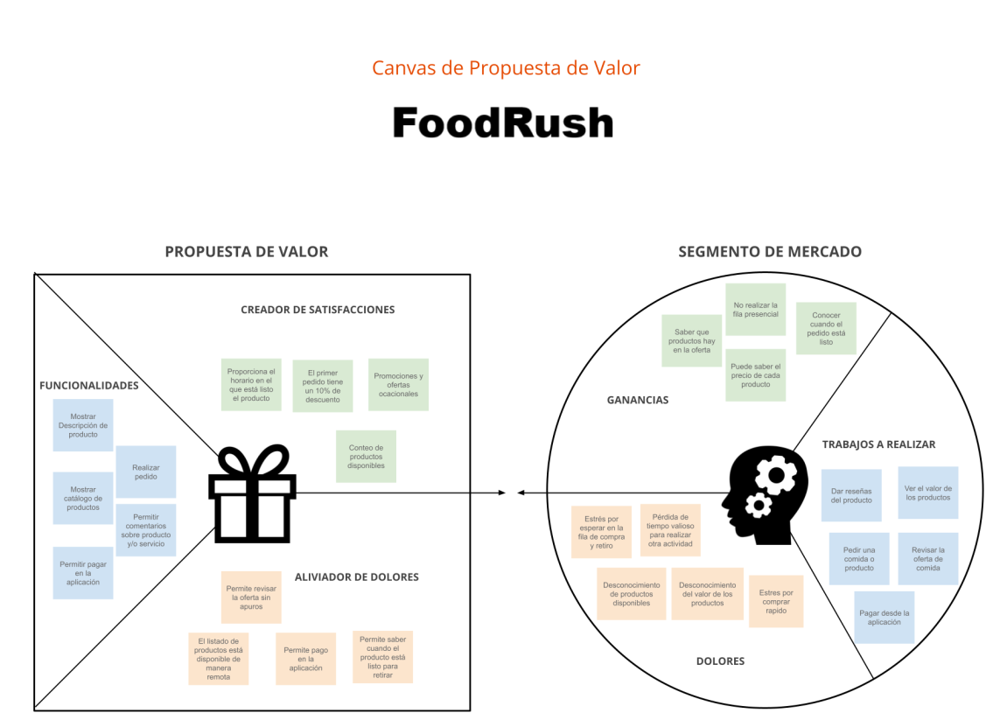

***

### 3.2. **UX Personas**

This section presents representative user profiles that illustrate the different needs, motivations, and behaviors of our main audience.
These personas help us design user experiences that truly align with the daily routines of students and university staff.

---

🔹 **Mauricio Valenzuela**  
*"Between classes and research, I sometimes just want to grab something quick."*

🔹 **Cristian Riquelme**  
*"Waiting in line takes away my study time and can make me late for class."*

🔹 **Lorena Pérez**  
*"I’d love an app that helps me eat what I want without wasting time."*

---

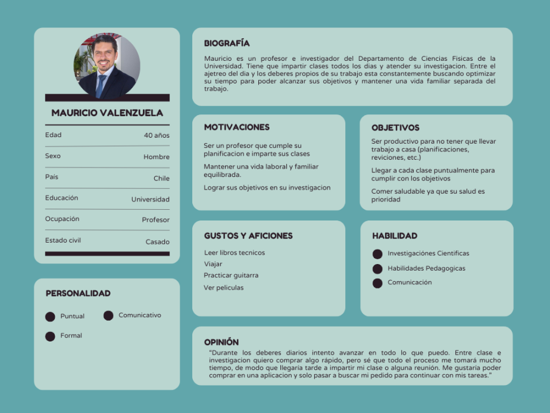

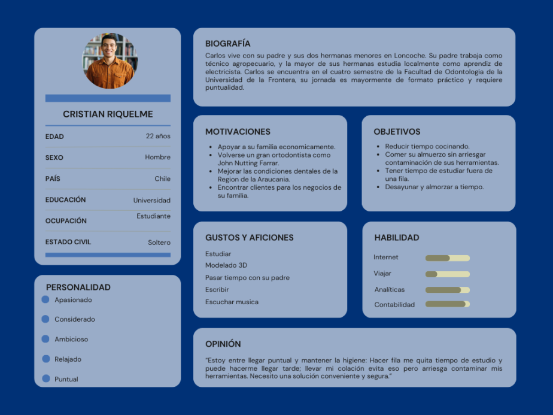

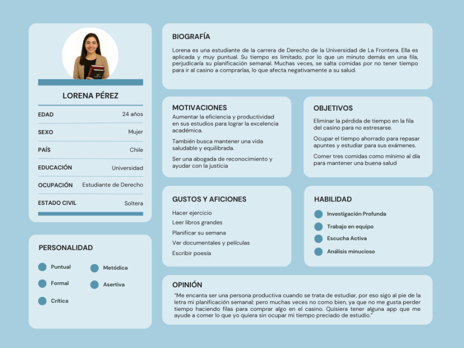

### 3.3. Benchmarking

To design an application that genuinely addresses the needs of university students and campus food vendors, we analyzed existing food delivery and ordering platforms — including both direct competitors

The objective was to identify **functional and visual strengths** across similar products, learn from their best practices, and pinpoint opportunities where Food Rush can stand out within the campus

---

#### Types of platforms analyzed

-  **Direct competitor:**
 **PedidosYa** — Although it’s a leading food delivery app in Latin America, it is not tailored to the university environment. It focuses on full delivery services rather than quick on-campus pickups.

-  **Visual comparison tools:**
 **Rappi** and **Uber Eats** — Both platforms provide highly optimized interfaces for browsing and comparing food options quickly. Their order-tracking flows, restaurant categorization, and clean ui designs were particularly insightful.

-  **Aesthetic references:** 
**Rappi** and **PedidosYa** — Both apps inspired the visual direction of Food Rush, particularly their use of vibrant color palettes, rounded UI elements, and iconography that communicates speed.

---

By combining insights from these platforms, Food Rush aims to deliver a **focused, lightweight, and context-aware experience** — optimized for campus life, where time, simplicity, and accessibility are paramount.

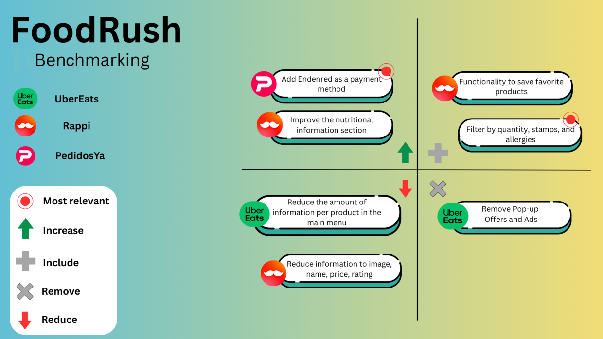

---

## 4. Scope

### 4.1. Customer Journey Map

We identified four key stages in the user's interaction with FoodRush:

- 🔍 Awareness
- 🤔 Consideration
- ✅ Decision
- 💬 Loyalty & Advocacy

These stages reflect the complete journey — from first contact to long-term perception and potential recommendation.

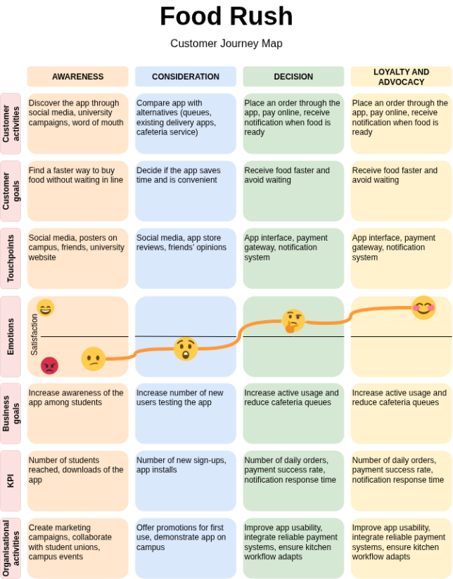

#### 4.1.1. Decision Stage Interfaces

**Customer Activities**:
During the **Decision** stage, users actively interact with the app: browsing menus, selecting items, and placing an order. They use features such as product filtering, payment options.
The app interface is designed to minimize waiting times and ensure a fast, reliable pickup experience.

**Customer Goals**:
Users want to receive their food quickly and conveniently, without wasting time standing in line. For many students and staff members, time efficiency is the primary motivation for using the app.

**Touchpoints**:
At this stage, the main touchpoints are the **mobile app interface**, the **payment gateway**, and the **notification system**.
- The **app interface** focuses on simplicity and clarity.
- The **payment gateway** ensures security and compatibility with common payment methods and *Edenred*.
- The **notification system** informs users when their order is ready, reinforcing reliability and trust.

---

## 5. Structure

### 5.1. Navigation Flow

The **Food Rush** navigation flow was designed to provide a fast, intuitive, and user-centered experience, reducing waiting times and unnecessary steps during the ordering process.
The structure prioritizes clarity and quick access to key features, ensuring that both students and university staff can order food effortlessly from their mobile devices.

---

####  Key Sections:

- **Profile:** Users can manage personal data, configure payment methods (including Edenred), and customize app preferences.

- **Search Products:** Allows users to explore available meals, view product details, read reviews, and filter by options eligible for Edenred or other payment types.

- **Cart:** Users can review their selected products, choose a payment method, and confirm the order.

- **Orders:** Displays details of past orders, helping users reorder their favorites or check transaction records.

- **Favorites:** Provides quick access to saved meals or frequently purchased products.

- **Notifications:** Keeps users informed about order status updates, promotions, and ready-for-pickup alerts.

---

####  Accessibility and Flow

- The user journey begins with **Registration** or **Login**, leading directly to the **Home** interface.
- From there, users can seamlessly navigate across main modules without leaving the home environment.
- The design minimizes friction between **searching**, **ordering**, and **receiving notifications**, supporting a fluid interaction loop.
- Each step of the flow reinforces Food Rush’s main value: **saving time and improving on-campus dining convenience.**

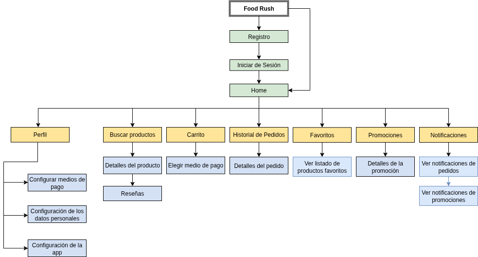

---

## 6. Skeleton

### 6.1. Low-fidelity wireframes

The wireframes developed serve as an initial approximation of the structure and visual layout of the interfaces tied to FoodRush's core functionalities—specifically, ordering food from university canteens.

Navigation between screens is primarily handled through a persistent top navigation bar, present across all interface screens for seamless user flow.

In the early iterations, the interfaces were initially organized into three main categories:

- Interfaces related to payment types.
- Interfaces related to Menu/Food Item Selection.
- Interfaces related to Order Status and History.

📄 **[Low-Fi Wireframes – FoodRush (PDF)](docs/wireframes-foodrush.pdf)**:
PDF version of the entire initial wireframe set, covering all main interface screens from the early design phase.

---

## 7. Evaluation and Adjustments (Final Stage)

This section documents the design validation process, presenting the results of the heuristic evaluation of the previous version and explicitizing the traceability of changes made in response to the feedback received.

### 7.1. Heuristic Evaluation and SEQ Results

To validate the initial version of the prototype and justify the final modifications, a **Heuristic Evaluation** and a usability test were conducted to measure the Single Ease Question (SEQ).

#### **SEQ Evaluation (Single Ease Question)**

The main task of "Buying Food" yielded an **average SEQ score of 5.2** (on a scale of 1 to 7).

| Score | Perception |
| :---: | :---: |
| 5.2 | Somewhat Easy |

This result indicates that users considered the task "somewhat easy" to complete. The report justification identified key areas for improvement that were addressed in the final version (Section 8.2), including:
1.  **Visual Clarity:** Improving the distinction between main buttons and action buttons.
2.  **Payment Flow:** Optimizing the order and layout of elements on the payment screen.
3.  **Feedback:** Adding immediate visual confirmations for critical actions (e.g., Add to Cart, Successful Purchase).

#### **Reference Document**
- 📄 **[Complete Heuristic Evaluation Report (PDF)](docs/Taller%20Evaluacio%CC%81n%20Heuri%CC%81stica.pdf)**

---

### 7.2. Change Traceability and Feedback

The final version of the project incorporates all improvements suggested by the professor, peer feedback, and teaching assistants. This iteration process ensures that the solution directly addresses the identified usability issues and enhances the overall user experience.

Below is a summary of the most significant adjustments and their origin:

| Adjustment Area | Iteration Description |
| :--- | :--- |
| **Payment Flow (Edenred)** | The payment interface was redesigned to optimize the order of fields (RUT, Dynamic Key) and space usage was resolved, improving readability. 
| **Identity and Context** | Irrelevant data (age, biography) was removed from the user profile and the focus was adjusted to the unique functionality (not being a simplified Rappi)
| **Shopping Experience** | The **order number** and **pickup location** were added to the confirmation/QR screen, eliminating ambiguity about where and what to pick up. Typography sizes were adjusted
| **Interface Usability** | The *Home* and product detail screens were refined, optimizing whitespace and improving the visualization of **Warning Seals**. The use of the favorites button was unified.

**Complete Traceability Document:**
- 📄 **[List of Suggested Improvements (PDF)](docs/Mejoras%20sugeridas%20cruzadas.pdf)**
---

## 8. Surface

### 8.1. Interface Evolution

## Interface Evolution Process: Explanations and Key Reasons for Modifications

The interfaces for FoodRush evolved significantly from the initial low-fidelity wireframes to the final high-fidelity prototypes, focusing on streamlining the food ordering process within the university canteen context.

**Homepage Evolution**

Categories Filter: Introduced "Todo" (All) and "Sin Sellos" (No Seals) as a quick filter option. This directly addresses student dietary concerns and speed of selection. Visual Appeal: Products now show high-quality images, enhancing attractiveness and aiding quick decision-making. Stock Indicators: Added clear "Out of Stock" states to prevent user frustration when selecting unavailable items.

  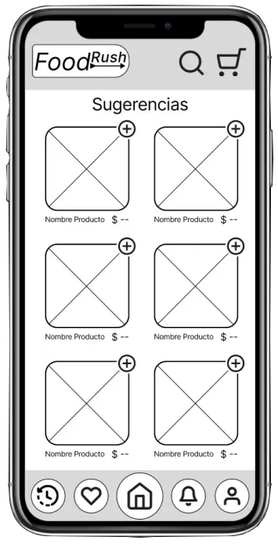
  &nbsp; &nbsp; &nbsp;
  

**Product Detail Evolution**

Removal of Delivery Time: Since the app focuses on canteen/on-campus ordering, delivery time is often irrelevant or managed through a separate pickup system, so the clock icon was removed for simplicity. Nutritional Seals Prominence: The final design prominently displays the Chilean Nutritional Warning Seals at the top, addressing a critical user need for health-conscious choices. Clear Call to Action: The "Add to Cart" button was redesigned to be more visually distinct and inviting, improving conversion rates.

  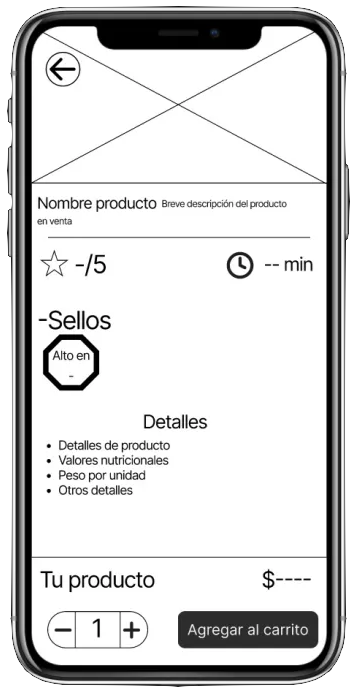
  &nbsp; &nbsp; &nbsp;
  

**Cart and Checkout Evolution**

Reduced Cognitive Load: The final design acts as a gateway; clicking a button (like "Edenred") likely leads to a separate screen for data entry, rather than cluttering the initial checkout screen with too many fields. This reduces overwhelm and focuses the user on one task at a time.

  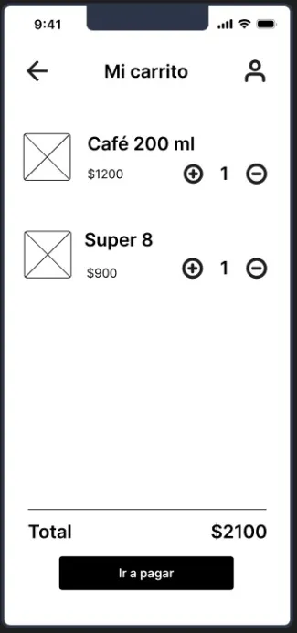
  &nbsp; &nbsp; &nbsp;
  

  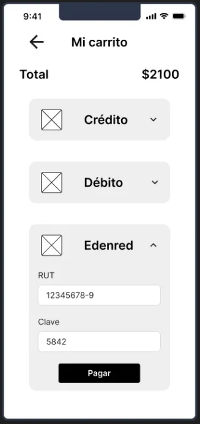
  &nbsp; &nbsp; &nbsp;
  

**Order Receipt and QR Code Evolution**

Improved Readability: The final design uses clear typography and visual cues (numbered items, orange price tags) to quickly convey the order summary. Clarity of Action: The button was renamed from the generic "Generate QR" to "Show Pickup Code," making its purpose explicit.

Focus and Speed: For a canteen pickup, the only critical information is the QR code itself. By removing the repetitive date/time/price information, the screen becomes cleaner and the QR code is the sole focus.

  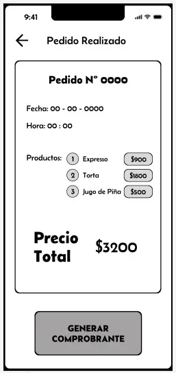
  &nbsp; &nbsp; &nbsp;
  

  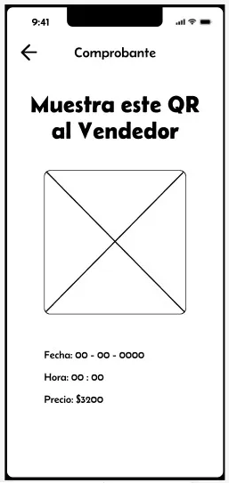
  &nbsp; &nbsp; &nbsp;
  

***

#### Redesign of the navigable prototype

The final visual design aimed to create an app that felt fast, trustworthy, and easy to use for a student audience needing quick transactions.

**High-Contrast Orange:** Selected as the primary action color. It is highly visible and evokes energy, speed, and appetite—perfect for a food app.

**Integration of Real-World Constraints (Sellos):** Prioritizing the visual display of Chilean food seals in the product view directly addresses a crucial consumer concern in Chile, making the app more relevant and trustworthy.

**Simplified Payment Flow:** Moving from an initial flow that exposed sensitive fields (RUT, Clave) on the main payment screen to one that uses large, clean buttons significantly improves security perception and usability.

**Exploration and comparison of options:** The design supports informed decisions by providing concrete data and comparative analysis.

The evolution shows a clear shift from a purely functional structure to a high-fidelity interface prioritizing user experience, visual branding, and regulatory context (food seals).
***

### 8.2. High Definition Interfaces

With the functional structure defined by the low-fidelity wireframes and the key user experience issues resolved during the evolution phase (Section 8.1), the project transitioned to the High-Fidelity Interface design stage.

The final interfaces establish the FoodRush brand identity, leveraging a high-contrast orange-and-dark blue palette to ensure accessibility and highlight primary actions like "Add to Cart" and "Pay." 

The final interface set includes additional designs for the application's onboarding process, user profile management, and order history tracking, ensuring a comprehensive user experience from first use to repeat engagement.

  
  &nbsp; &nbsp; &nbsp;
  

  
  &nbsp; &nbsp; &nbsp;
  

  
  &nbsp; &nbsp; &nbsp;
  

**Project Resources**

The final high-definition interfaces and navigable prototype encompass the complete user experience for FoodRush. These resources detail the finished visual style, interaction patterns, and user flows.

A complete set of resources and documentation for the project is available below:

- 📁 **[Hi-Fi Interfaces Workspace – FoodRush (Figma)](https://www.figma.com/design/M46L5Bl5BYqWEArmIUBbKi/Avance-1-Proyecto?node-id=0-1&t=baXchoLeGoMM5Cs9-1)**: Final high-fidelity interface designs available in the shared Figma workspace.
- 📁 **[Hi-Fi Prototype – FoodRush (Figma)](https://www.figma.com/proto/M46L5Bl5BYqWEArmIUBbKi/Avance-1-Proyecto?node-id=14-1464&t=GQMdMsdWHiVXJtkq-1)**: Final high-fidelity prototype available in the shared Figma workspace.
- 📄 **[Hi-Fi Interfaces – FoodRush (PDF)](docs/hi-fi-interfaces-foodrush.pdf)**: PDF version containing the full set of final interfaces, including visual styles and interaction details.

---

---

### 8.3. Accessibility & Inclusive Design

The High-Fidelity Interface design for **FoodRush** strictly adhered to accessibility principles (based on WCAG guidelines) to ensure the system is usable by the widest possible range of students and university staff, including those with disabilities.

| WCAG Principle | Application in FoodRush |
| :--- | :--- |
| **Perceptible** | **High Contrast & Warning Seals:** We utilized a high-contrast palette (Dark Blue/Vibrant Orange) to ensure text legibility. Crucially, we integrated the **Chilean Nutritional Warning Seals** prominently in product views, ensuring users can easily identify healthy options. |
| **Operable** | **Thumb-Zone Navigation:** Addressing the heuristic finding regarding navigation difficulties, we implemented a persistent, large-target bottom navigation bar. Buttons in the cart and checkout screens are generously sized for easy tapping. |
| **Understandable** | **Clear Terminology:** We replaced ambiguous technical terms like "Items" (found in the Alpha version) with natural language like specific product names or clear quantities. 
| **Robust** | **Assistive Technology Ready:** The interface hierarchy (Header -> Content -> Action Button) is structured to be screen-reader friendly. Text resizing is supported by maintaining generous spacing and scalable UI elements. |

---

## 9. Project Closure & Final Conclusion

This section marks the culmination of Stage 3 and the **final delivery** of the FoodRush UXD project. We have transitioned from abstract problem definition (Strategy) to a fully validated, high-fidelity prototype ready for development hand-off.

### 9.1. Validation & Heuristic Improvements

To ensure the final design was not just visually appealing but functionally robust, we conducted a Heuristic Evaluation using the **Single Ease Question (SEQ)** metric.

* **SEQ Score Achieved:** **5.2 / 7.0** (Rated: "Somewhat Easy").
* **Interpretation:** While the core flow was functional, the score highlighted friction points that were meticulously polished in this final version.

**Key Iterations based on Data:**
1.  **Navigation Awareness:** The heuristic report noted a lack of active section indicators. The final version now clearly highlights the active tab in the bottom bar (Home/Orders/Profile).
2.  **Cart Logic:** Evaluation users struggled with the inverted + / - buttons. The final interface corrected this standard pattern and removed the redundant "Trash" icon, streamlining the deletion process.
3.  **Information Architecture:** Early feedback indicated that profile screens were cluttered with irrelevant data (like "Biography"). The final profile is strictly functional, focusing on Payment Methods and Personal Info.

### 9.2. Interface Evolution: Before vs. After

The evolution from *Advance 1* to the *Final Version* represents a shift from a low-fidelity functional wireframe to a branded, user-centric product.

| Feature | ❌ Alpha Version (Advance 1) | ✅ Final Version (Stage 3) |
| :--- | :--- | :--- |
| **Onboarding** | Generic "Log In" text buttons with no context. | **Branded Onboarding:** Complete flow with role selection (Client vs. Merchant) and Google integration. |
| **Visual Identity** | Generic layout, inconsistencies in spacing and button hierarchy. | **FoodRush Branding:** Consistent use of rounded UI cards, shadow depth, and the signature Orange/Blue palette. |
| **Product Detail** | Text-heavy list of nutritional details. | **Visual & Regulatory Compliance:** Integration of graphical "Warning Seals" and clear "Add to Cart" CTA. |
| **Payments** | Basic placeholders for card entry. | **Edenred Integration:** A dedicated, secure flow for student benefit cards (Junaeb/Edenred) with optimized input fields. |
| **Order Tracking** | Static text lists. | **Interactive States:** Clear visual timeline (Receiving -> Preparing -> Ready) using a QR code system for pickup. |

### 9.3. Final Project Deliverables

The FoodRush project is now ready for the development hand-off. The following resources encompass the complete design system, validated logic, and interactive prototypes.

| Resource | Description | Link |
| :--- | :--- | :--- |
| **Navigable Prototype** | Final interactive version for user flow testing. | [Link to Figma Proto](https://www.figma.com/proto/M46L5Bl5BYqWEArmIUBbKi/Avances-Proyecto-FoodRush?page-id=223%3A896&node-id=372-4681&viewport=274%2C344%2C0.07&t=GClVA5NGmkFkzhHN-1&scaling=min-zoom&content-scaling=fixed&starting-point-node-id=385%3A1081)
| **Figma Worksapace** | Full source files with assets and design specs. | [Link to Figma Design](https://www.figma.com/design/M46L5Bl5BYqWEArmIUBbKi/Avances-Proyecto-FoodRush?node-id=223-896&t=IHMX60HdX5duTUlZ-1)
| **Final Documentation (PDF)** | Comprehensive compilation of High-Fidelity interfaces. | 📄 **[Final FoodRush Project Advances (PDF)](docs/Avances%20Proyecto%20FoodRush%20Final.pdf)** |

---

## 10. Feedback Implementation Report & Change Traceability

This document summarizes the feedback received from the Project Lead (Professor), Teaching Assistants, and Peers during the design reviews. It details the specific changes implemented in the final version of the **FoodRush** interfaces to address every identified issue.

### 10.1. Feedback Summary

The feedback was categorized into four main areas of improvement:

* **Strategic Alignment (Context):** The initial proposal resembled a generic delivery app (like Rappi) too closely. The feedback emphasized the need to ground the app specifically in the university context (UFRO Canteens), focusing on logistics (pickup points), daily menus, and student benefits.
* **Information Architecture (Content):** Critical information was missing or poorly prioritized, such as pickup locations, order numbers, and nutritional warning seals. Conversely, the user profile contained irrelevant data (Age, Biography).
* **User Interface (Visuals):** Issues regarding whitespace usage (too much empty space), color contrast (legibility of red on yellow), and low fidelity in payment screens (looking like wireframes).
* **Interaction Design (Flow):** Confusion in button hierarchy (Login vs. Sign up), counter-intuitive controls (+/- buttons inverted), and lack of feedback in the "Add to Cart" process.

---

### 10.2. Detailed Change Log (Interface Evolution)

The following table explicitly details the "Before" state (Feedback) and the "After" state (Final Solution) for every screen and flow.

#### 10.2.1. Strategy & Core Value
| Area | Feedback / Issue Identified | Implemented Solution |
| :--- | :--- | :--- |
| **Context** | "The proposal looks like a simplified Rappi; it needs to be specific to UFRO canteens." | **Redefined Scope:** The app is now strictly a "Pre-order & Pickup" system for University Canteens, not a general delivery service. |
| **Logistics** | "Where do I buy? Where do I pick up? How long will it take?" | **Pickup Logic:** Added specific "Pickup Location" fields in the Cart and Receipt screens. Added estimated preparation status. |
| **Catalog** | "Don't just offer basic snacks. Include daily lunches and stock." | **Menu Expansion:** The interface now supports "Daily Menus" with stock indicators and detailed descriptions. |

#### 10.2.2. Onboarding & Login
| Area | Feedback / Issue Identified | Implemented Solution |
| :--- | :--- | :--- |
| **Visual Hierarchy** | "Login and Sign-up buttons have the same visual weight." | **Hierarchy Fixed:** Differentiated the buttons. "Login" is now the primary action (filled), and "Sign Up" is secondary (outlined/ghost). |
| **Readability** | "Red text on yellow background looks weird/hard to read." | **Contrast Adjustment:** Adjusted the color palette to Dark Blue and High-Contrast Orange for better readability and accessibility. |
| **Value Prop** | "The login screen is too empty; what value does the app offer?" | **Intro Screens:** Added onboarding carousel screens explaining the value proposition before the login form. |
| **Features** | "Missing Password Reset." | **Added Feature:** Implemented a "Forgot Password" flow. |

#### 10.2.3. Home & Catalog Navigation
| Area | Feedback / Issue Identified | Implemented Solution |
| :--- | :--- | :--- |
| **Product Cards** | "Where are the units? Products without stock?" | **Stock Handling:** Added "Out of Stock" visual states and clear unit measurements (e.g., "250g"). |
| **Layout** | "Footer and Menu need separation; Filter colors are uneven." | **UI Polish:** Added a subtle shadow/stroke to separate the Bottom Navigation Bar. Standardized filter chip colors. |
| **Loading** | "Missing loading state." | **Feedback:** Added a skeleton loader/spinner animation while data is fetching. |

#### 10.2.4. Product Details
| Area | Feedback / Issue Identified | Implemented Solution |
| :--- | :--- | :--- |
| **Layout** | "Too much wasted white space." | **Optimization:** tightened the layout. Moved nutritional seals to a prominent position near the title. |
| **Relevance** | "Remove 'Ratings' (not useful for canteens)." | **Content Strategy:** Removed the star rating system. Replaced it with **Nutritional Warning Seals** (Sellos) which are mandatory and critical for students. |
| **Clarity** | "Differentiate 'Add to Cart' from '+/-' units." | **Button Design:** "Add to Cart" is now a wide, high-contrast primary button. Unit selectors are distinct icon buttons. |
| **Copywriting** | " 'Your Product' sounds like I already bought it." | **Text Update:** Changed headers to be descriptive (e.g., "Product Details") rather than possessive. |

#### 10.2.5. Cart & Payment
| Area | Feedback / Issue Identified | Implemented Solution |
| :--- | :--- | :--- |
| **Usability** | "Buttons + and - are reversed (counter-intuitive)." | **Standardization:** Fixed the order: **(-) Left** to decrease, **(+) Right** to increase. |
| **Information** | "I should see which Canteen I am buying from." | **Transparency:** The Cart header now clearly displays "Pickup at: [Canteen Name]". |
| **Payment UI** | "Edenred fields are hard to see; Gray boxes look like wireframes." | **High-Fidelity UI:** Redesigned payment cards with real branding (Visa/Edenred logos) and improved input field borders for visibility. |
| **Functionality** | "Delete item vs. Delete whole cart?" | **Interaction:** Added a clear "Trash" icon for individual items and a "Clear Cart" option. |

#### 10.2.6. Orders & Receipt (Post-Purchase)
| Area | Feedback / Issue Identified | Implemented Solution |
| :--- | :--- | :--- |
| **Critical Info** | "How do I know where to go? Missing Order Number." | **Receipt Redesign:** The QR screen now prominently displays the **Order Number** (e.g., #492) and the **Pickup Location**. |
| **Hierarchy** | "Date/Time are too big compared to the products." | **Visual Balance:** Reduced the size of timestamps. Prioritized the **QR Code** and **Total Price** as the main visual elements. |
| **Interaction** | "Generate QR... for what?" | **Button Label:** Renamed button to "Show Pickup Code" to clarify intent. Added a way to retrieve the QR from the "Orders" tab history. |
| **Logic** | "Cancel drink in preparation?" | **Status Logic:** Disabled cancellation once the order status moves to "Preparing" to reflect real kitchen constraints. |

#### 10.2.7. User Profile
| Area | Feedback / Issue Identified | Implemented Solution |
| :--- | :--- | :--- |
| **Data Privacy** | "Age, Job, and Biography are irrelevant for ordering food." | **Simplification:** Removed all social-media-style fields. The profile now only contains **Personal Info (Name/Email)** and **Payment Methods**. |
| **Edit Mode** | "Too many arrows; Need a pencil icon to edit." | **Iconography:** Replaced generic arrows with standard "Edit Pencil" icons for modifying profile data. |

---

## 11. Annexes and Documentation

This section provides direct access to all detailed documents, including evaluation reports and progress from previous stages.

### 1. Evaluation and Traceability Documents (Final Stage)
- 📄 **[Complete Heuristic Evaluation Report (PDF)](docs/Taller%20Evaluacio%CC%81n%20Heuri%CC%81stica.pdf)**
  Detailed report of the usability audit and SEQ results, justifying design adjustments.

### 2. Strategy Documents
- 📄 **[Value Proposition Canvas - FoodRush](docs/value-prop-canvas-foodrush.pdf)**
  Detailed analysis of user pains, gains, and our value proposition alignment
- 📄 **[UX Personas - FoodRush](docs/ux-personas-foodrush.pdf)**
  Complete user personas with detailed profiles, needs, and behaviors
- 📄 **[Benchmarking Analysis - FoodRush](docs/benchmarking-foodrush.pdf)**
  Comprehensive competitive analysis and market positioning

### 3. Scope and Structure Documents
- 📄 **[Customer Journey Map - FoodRush](docs/customer-journey-map-foodrush.pdf)**
  Detailed user journey mapping across all touchpoints and interactions
- 📄 **[Sitemap - FoodRush](docs/sitemap-foodrush.pdf)**
  Complete information architecture and navigation structure
- 📄 **[Low-Fi Wireframes - FoodRush](docs/wireframes-foodrush.pdf)**
  Complete set of low-fidelity wireframes for all main interfaces

### 4. Surface Documents
- 📄 **[Hi-Fi Interfaces - FoodRush (Advance 1)](docs/Proyecto%20FoodRush%20Avance%201.pdf)**
  High-fidelity interfaces from the first delivery.
- 📄 **[Hi-Fi Interfaces - FoodRush (Advance 2)](docs/Avances%20Proyecto%20FoodRush%20Final.pdf)**
  Final High-fidelity interfaces from the last delivery.

---
